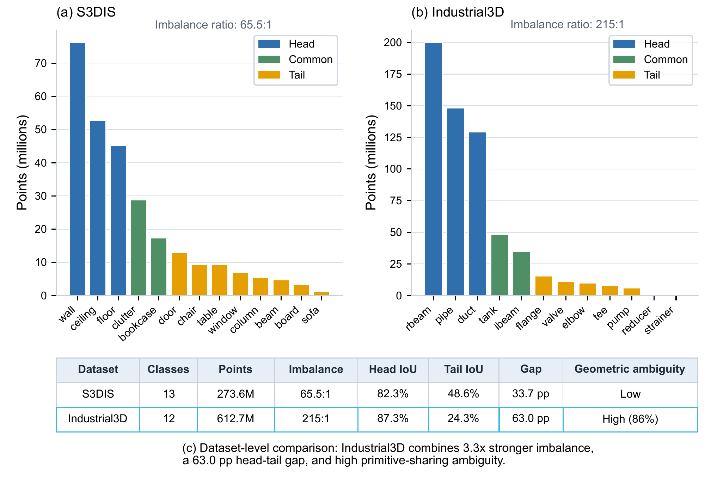
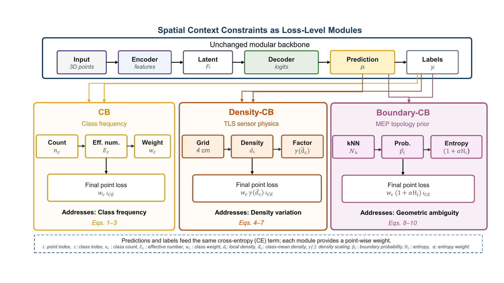
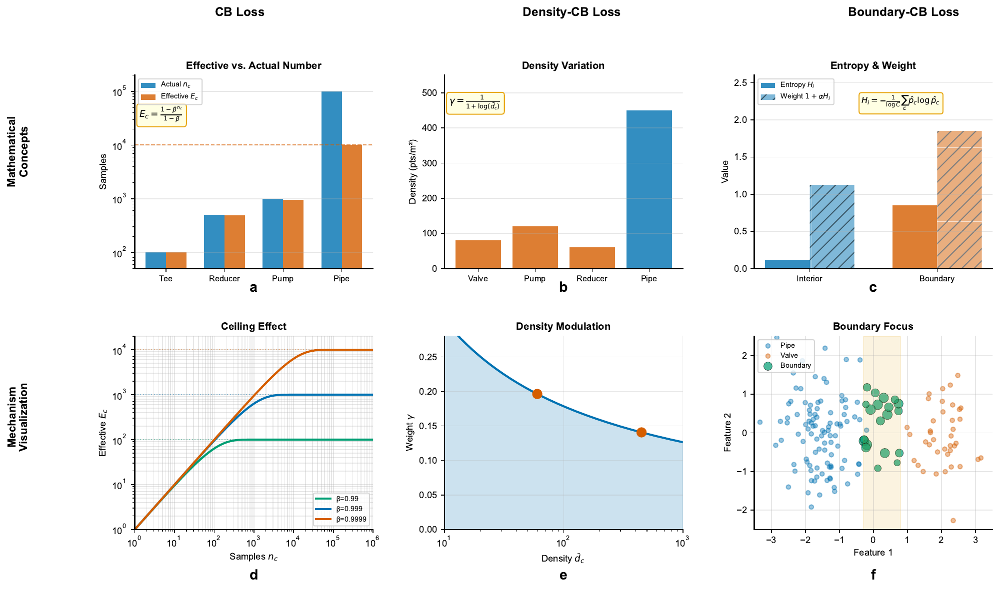
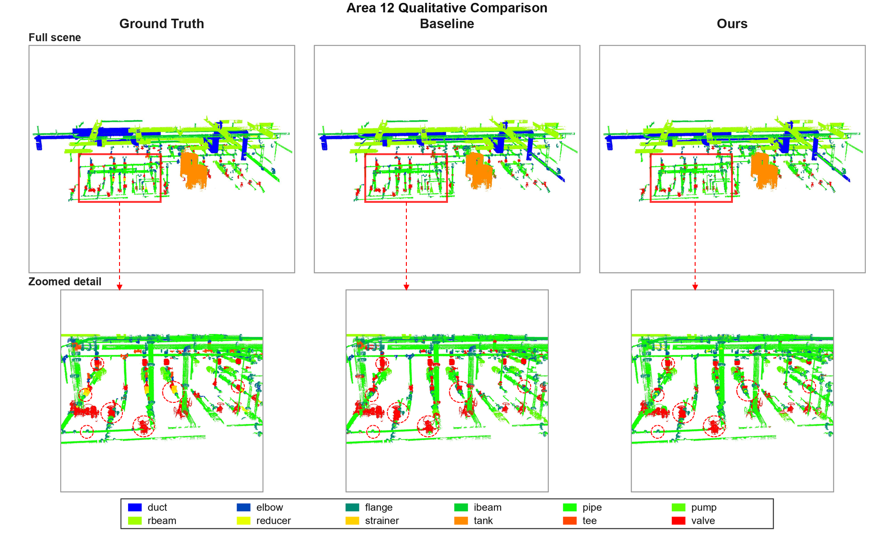
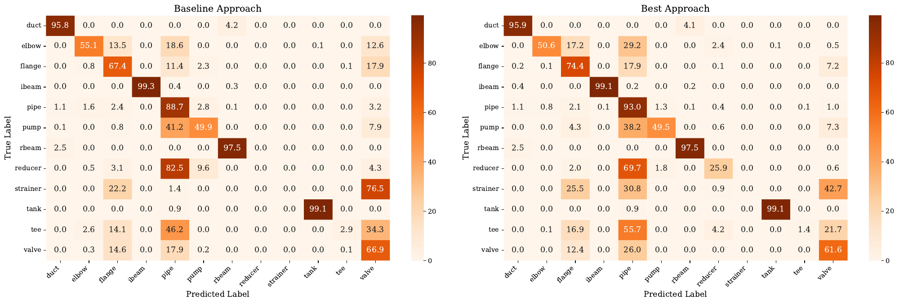

# LongTail3D

**Paper:** [Resolving Primitive-Sharing Ambiguity in Long-Tailed TLS-Based Industrial MEP Point Cloud Segmentation via Spatial Context Constraints](https://arxiv.org/abs/2601.19128) (**Under Review**)

**Dataset:** [Industrial3D](https://github.com/PointCloudYC/Industrial3D) ([website](https://pointcloudyc.github.io/industrial3d/index.html))

**Code Status:** The paper is under review. The source code and trained models for Boundary-CB and Density-CB will be released in this repository upon acceptance; the figures and results below preview the method.

## Overview

In terrestrial laser scanning (TLS) point clouds of mechanical, electrical, and plumbing (MEP) systems, safety-critical components such as reducers and valves are persistently misclassified. The cause is a **dual crisis**: extreme class imbalance (215:1) compounded by **primitive-sharing ambiguity**, because six of the seven tail classes share cylindrical primitives with dominant head classes such as pipes. Frequency-based re-weighting alone cannot resolve this ambiguity.

LongTail3D extends [Class-Balanced (CB) loss](https://arxiv.org/abs/1901.05555) with two **spatial context constraints** that act at the loss level and leave the segmentation backbone unchanged:

- **Boundary-CB** up-weights points whose k nearest neighbors disagree in their predictions (high neighborhood entropy), such as pipe-to-reducer and pipe-to-valve transitions. It encodes an MEP assembly-topology prior.
- **Density-CB** rescales the loss by the class-average local point density to compensate for scan-dependent density variation. It encodes TLS sensor-physics knowledge.

## Highlights

- Identifies a dual crisis in TLS-based MEP scenes: 215:1 class imbalance compounded by geometric ambiguity, with 6 of 7 tail classes (86%) sharing cylindrical primitives with head classes.
- Proposes two engineering-knowledge-informed spatial context constraints, Boundary-CB and Density-CB, as plug-and-play loss terms that need no backbone changes.
- Explains both constraints through intuitive metaphors and mathematical visualizations.
- Achieves 55.74% mIoU on Industrial3D with ResPointNet++, a 21.7% relative tail-class improvement (29.59% vs. 24.32%), while preserving head-class accuracy (88.14%).
- Improves Reducer IoU from 0% to 21.12% and Valve IoU by 24.3% relative (38.06% to 47.32%).

## Figures



*Figure: Class distributions of S3DIS (a) and Industrial3D (b), and a dataset-level comparison (c). Industrial3D combines a 215:1 imbalance with high primitive-sharing ambiguity.*



*Figure: Spatial context constraints as loss-level modules. CB, Density-CB, and Boundary-CB each give a point-wise weight for the same cross-entropy term, so the backbone is unchanged. For clarity, the diagram omits the focal factor that Density-CB and Boundary-CB share with CB+Focal.*



*Figure: Schematic of the three mechanisms: the CB effective number and its ceiling effect (a, d), the Density-CB density modulation (b, e), and the Boundary-CB neighborhood entropy, weight, and boundary focus (c, f).*



*Figure: Qualitative results on Industrial3D Area 12: ground truth, the cross-entropy baseline, and predictions with spatial context constraints (Ours), with zoomed views of reducer- and valve-rich piping. Red dashed circles mark representative tail-component regions.*



*Figure: Row-normalized confusion matrices (%) on the Area 6+12 evaluation split for the baseline (left) and Boundary-CB (right). Boundary-CB recognizes Reducer (recall 0% to 25.9%) and labels fewer Pipe points as Elbow, Pump, or Valve.*

## Method

Both constraints multiply the CB+Focal point loss by one spatial factor $m_i$:

$$\mathcal{L} = \frac{1}{N}\sum_{i=1}^{N} w_{y_i}\, m_i\, \phi_i\, \ell_{\mathrm{CE}}\big(f_\theta(p_i), y_i\big)$$

where $w_c = (1-\beta)/(1-\beta^{n_c})$ is the CB weight of class $c$ with $n_c$ points ($\beta = 0.9999$) and $\phi_i = (1 - f_\theta(p_i)_{y_i})^{\gamma_f}$ is the focal factor ($\gamma_f = 2$).

| Constraint | Factor $m_i$ | Setting |
| --- | --- | --- |
| Density-CB | $1/(1 + \log \bar{d}_{y_i})$, where $\bar{d}_c$ is the mean number of neighbors within radius $r$ over the points of class $c$ | $r = 0.2$ m |
| Boundary-CB | $1 + \alpha H_i$, where $H_i \in [0, 1]$ is the entropy of the mean prediction over the $k$ nearest neighbors of point $i$, normalized by $\log C$ | $k = 64$, $\alpha = 1$ |

## Results

Results with a ResPointNet++ backbone on the predefined Industrial3D evaluation split (Areas 6 and 12; IoU, %):

| Method | mIoU | Head | Common | Tail | H-IoU |
| --- | --- | --- | --- | --- | --- |
| ResPointNet++ (cross-entropy baseline) | 52.48 | 87.28 | 98.82 | 24.32 | 38.04 |
| CB+Focal | 54.09 | 87.39 | **99.06** | 26.97 | 41.21 |
| Density-CB (ours) | 54.27 | 88.05 | 98.28 | 27.23 | 41.59 |
| **Boundary-CB (ours, k = 64)** | **55.74** | **88.14** | 98.64 | **29.59** | **44.31** |
| Combined (ours) | 53.59 | 87.05 | 97.38 | 26.74 | 40.91 |

Head: Duct, Pipe, RectangularBeam. Common: I-beam, Tank. Tail: Elbow, Flange, Pump, Reducer, Strainer, Tee, Valve. H-IoU is the harmonic mean of head and tail mIoU. Scores are best-epoch results on the evaluation split, which was also used for model selection; see the paper for per-class and ablation results. For context, RandLA-Net and PTv3 reach 39.83% and 41.90% mIoU on the same split.

## Citation

If you find this work useful, please cite:

```bibtex
@article{yin2026resolving,
  title={Resolving Primitive-Sharing Ambiguity in Long-Tailed TLS-Based Industrial MEP Point Cloud Segmentation via Spatial Context Constraints},
  author={Yin, Chao and Han, Qing and Hou, Zhiwei and Liu, Yue and Dai, Anjin and Hu, Hongda and Yang, Ji and Yao, Wei},
  journal={arXiv preprint arXiv:2601.19128},
  year={2026}
}
```

### Related Work

```bibtex
@article{yin2026industrial3d,
  title={Industrial3D: A Water-Treatment TLS Point Cloud Dataset and Cross-Paradigm Benchmark for MEP Scene Understanding},
  author={Yin, Chao and Yue, Hongzhe and Han, Qing and Hu, Difeng and Liang, Zhenyu and Lin, Fangzhou and Sun, Bing and Wang, Boyu and Li, Mingkai and Yao, Wei and Cheng, Jack C.P.},
  journal={arXiv preprint arXiv:2603.28660},
  year={2026}
}

@article{yin2021,
  title={Automated semantic segmentation of industrial point clouds using ResPointNet++},
  author={Yin, Chao and Wang, Boyu and Gan, Vincent JL and Wang, Mi and Cheng, Jack CP},
  journal={Automation in Construction},
  volume={130},
  pages={103874},
  year={2021},
  publisher={Elsevier},
  doi={10.1016/j.autcon.2021.103874}
}
```

## License

This project is released under the [GNU General Public License v3.0](LICENSE).
